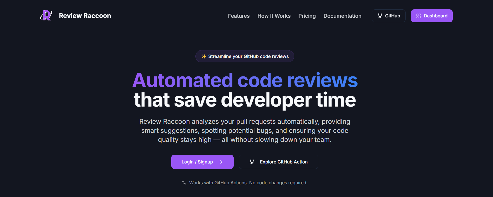
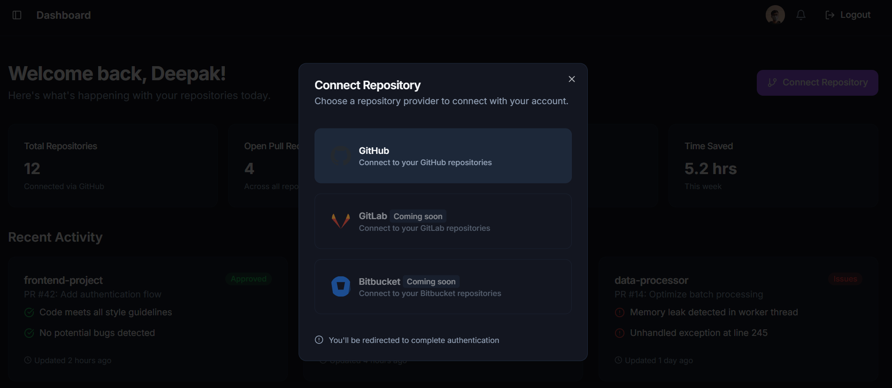
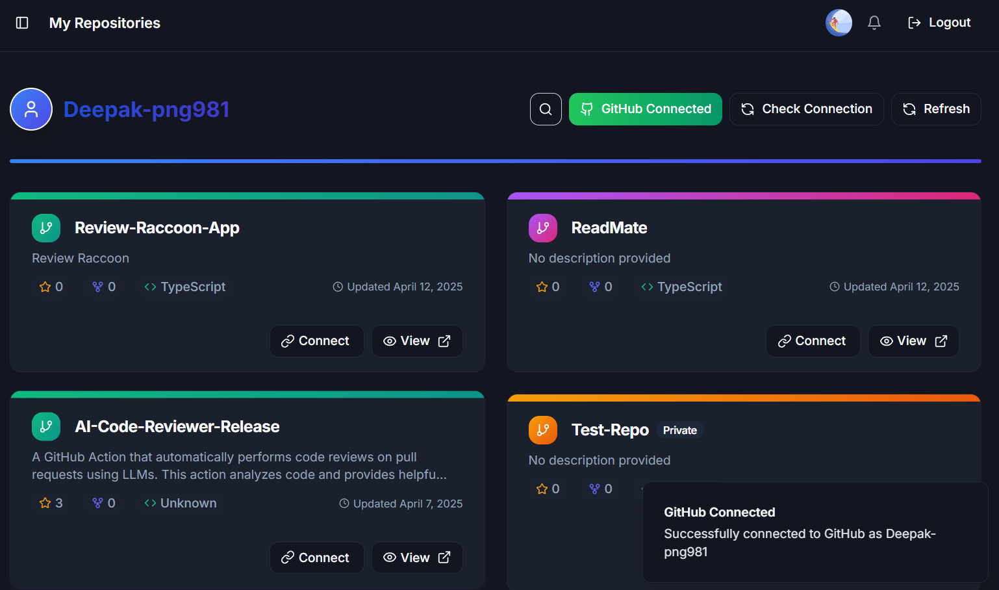
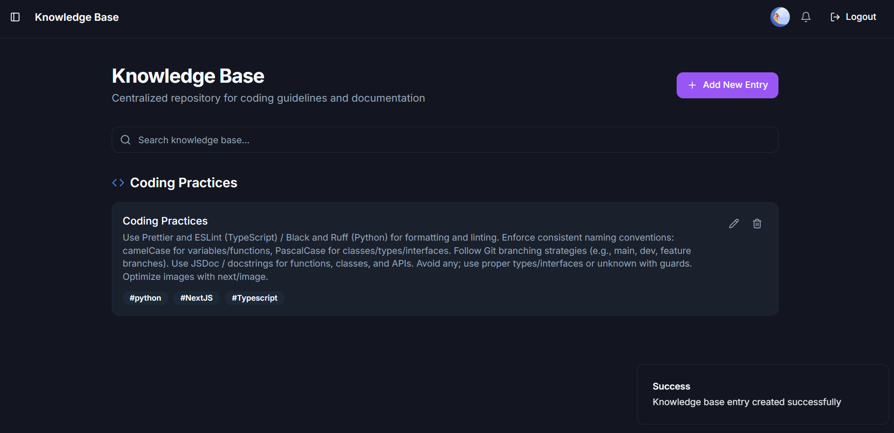

# Review Raccoon 🦝

> Your AI-Powered Code Review Assistant

Review Raccoon is an intelligent code review assistant that automatically analyzes your pull requests using state-of-the-art AI models. Think of it as having a helpful senior developer on your team, available 24/7 to review your code changes.

## 🌟 Why Developers Love Review Raccoon

- **Save Time**: Automated initial code reviews mean faster feedback loops
- **Improve Code Quality**: Catch potential issues before they reach human reviewers
- **Learn & Grow**: Get intelligent suggestions and best practices from AI analysis
- **Seamless Integration**: Works directly with your GitHub workflow
- **Customizable**: Choose your preferred AI model for reviews
- **Quick Setup**: Connect your repositories in minutes

## 🎯 Features

### Intelligent Dashboard
Track all your connected repositories and review activities in one place.

### Easy Repository Connection
Connect your GitHub repositories with just a few clicks.

### Knowledge Base
Access comprehensive documentation and best practices.

### Key Features
- 🤖 AI-Powered Code Analysis
- 🔍 Automated Code Review
- 🎯 Issue Detection
- 💡 Intelligent Suggestions
- 🔄 GitHub Integration
- ⚡ Real-time Feedback
- 📊 Review Analytics
- 🛠️ Customizable Settings

## 🛠️ Tech Stack

- **Framework**: Next.js 13
- **Language**: TypeScript
- **Styling**: Tailwind CSS
- **Authentication**: NextAuth.js
- **API Integration**: GitHub API
- **AI Integration**: Various AI model APIs
- **UI Components**: Shadcn UI

## 🤝 Contributing

We welcome contributions! Please feel free to submit a Pull Request.

1. Fork the repository
2. Create your feature branch (`git checkout -b feature/AmazingFeature`)
3. Commit your changes (`git commit -m 'Add some AmazingFeature'`)
4. Push to the branch (`git push origin feature/AmazingFeature`)
5. Open a Pull Request

## 📝 License

This project is licensed under the MIT License - see the [LICENSE](LICENSE) file for details.

## 🌟 Support

If you like Review Raccoon, please give it a ⭐️ on GitHub!
